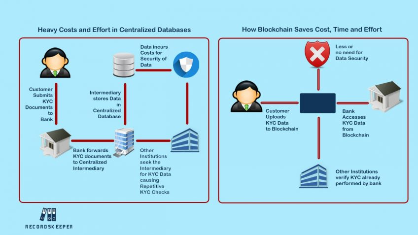
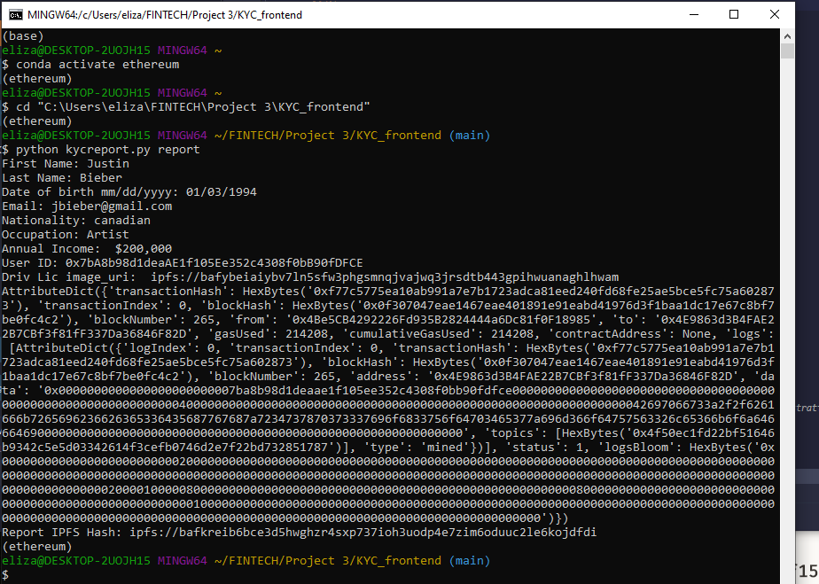
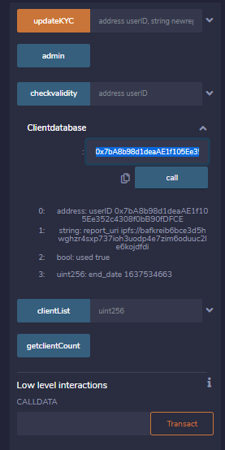

# Know Your Customer (KYC) on Blockchain

*Source: https://www.devteam.space/blog/why-is-blockchain-a-good-solution-for-kyc-verification/*

## Introduction

The objective of this project is to explore the possibilities of integrating blockchain into Anti-Money Laundering(AML) practices. We have used Solidity to create a smart contract to input and update information on the blockchain for the purpose of streamlining the Know Your Customer (KYC) process.

AML refers to the global laws, regulations, and procedures that are in place to prevent the act of producing income through illegal activities. The issue with the current AML procedures are that they are not able to keep pace with the evolving complexity and volume of financial transactions which becomes a problem for keeping a check on money Laundering activities.

KYC is a component of AML; they are the certain details that the business keeps as an end criteria for the identification of customers who are interested in doing business with them. Some predominant issues that are being faced by the current KYC compliances include issues related to corruption, terrorist financing, identity thefts and illegal tax avoidance.

According to The LexisNexis® Risk Solutions 2019 True Cost of AML Compliance Study for the United States and Canada, the annual AML compliance costs for the United States and Canadian financial institutions totaled $31.5 billion USD

## How Can Blockchain Help? 

Blockchain technology allows for the creation of a distributed ledger that is then shared to all users on the network. Utilizing Blockchain as a distributed ledger system has the potential to unlock the advantages of automated processes such as reducing compliance errors. A blockchain-based registry would not only remove the repetitive efforts of implementing KYC checks, but the ledger would also enable encrypted updates to client accounts to be distributed in near real-time. 

A KYC utility system based on blockchain technology will enable the financial and banking sectors to emancipate the process of identity verification. Currently, our data is collected and stored in a centralized system, such as a repository. With the introduction of blockchain solutions to handle the KYC process, data will be available on a decentralized network and can, therefore, be accessed by third parties directly after permission has been given.

This blockchain-based KYC system will also offer better data security by ensuring that data access is only made after a confirmation or permission is received from the relevant authority. This will eliminate the chance of unauthorized access and subsequently give individuals greater control over their data.

This ledger will provide a historical record of all documents shared and compliance activities undertaken for each client. Blockchain technology is also helpful in identifying entities attempting to create fraudulent histories. Within the provisions of data protection regulation, the data in the blockchain is immutable and could be analysed to identify irregularities - this can directly target criminal activity.

*Source: https://www.devteam.space/blog/why-is-blockchain-a-good-solution-for-kyc-verification/*

## Building the KYC System

A KYC System is built using a command line interface that will upload and pin KYC reports to IPFS via Pinata, permanently storing them on-chain by using the register KYC function in the KYC smart contract.

1. A Smart contract  `kyccontract.sol` is created with the `msg.sender` as contract administrator. Using a struct, we created a `client` object which is stored in a mapping called `clientdatabase`. Each client is mapped to an address called `userID`.

    The following functions make up the contract:

    * `registerKYC`: used to upload customer information into the `kyc` contract with `userID` as the address and `report_uri` that has all the details of the customer account. Simultaneously, the client is added to a list that is used to track KYC expiry dates. A check for duplicate records is also part of this function.

    * `updateKYC`: used to update any changes to an existing client record by adding a new `report_uri` that has the updated information.

    * `checkvalidity`: used to track validity of a customer report.The KYC report for customers is valid for upto `365 days`. 

    * `clientLoop`: used to iterate over the list of clients and pull out reports that are about to expire in the next 30 days. A log is generated for the administrator i.e. the msg.sender to follow-up with customers to update their KYC information.
        
2. This contract is deployed in Remix IDE. 

3. A new `KYC_frontend` directory is created where a `.env` file is stored with Pinata API Key and Secret API Key, address of the deployed smart contract and the WEB3 provider uri.

4. The deployed `kyccontract.sol` contract ABI is copied and stored in a `kyc.json` file.

5. A Python file `kyc.py` is created. In this file:

   * Import web3.auto, load the environment variables using dotenv, and import the Path library from pathlib to fetch our ABI.

   * A headers object to populate the variables defined in .env.

   * An initContract function, that will need to return the web3 contract object that will allow it to interact with the kyc contract on-chain.

   * A convertDataToJSON function, to convert customer data to json format.
   
   * A pinJSONtoIPFS function, with a POST request to the pinJSONtoIPFS endpoint on Pinata. 

6. Another file called `kycreport.py` is created. In this file:

    * Import the kyc.py functions into this file.

    * A `kyccontract` object is created using the initContract function from `kyc.py`.

    * In the `createkycReport` function, user data is fetched by using the input function in Python. 

    * Pass the user data variables to the convertDataToJSON function. Store the result in json_data, then pass json_data to the pinJSONtoIPFS function and save that as report_uri. Return the user_id, email and report_uri variables.

    * In the `kycreport` function, we will generate the transaction that talks to the kyc smart contract and returns the transaction receipt.

    * Another function called `kycupdate` will talk to the update function in the kyc smart contract to update records and return the transaction receipt.

    * A `main` function we will is put the pieces together. In the `report` flow will create the kyc report then, store the receipt, and pretty print the results after. A similar `update` flow will create a report with the updated information and print the receipt.
    
## Launching the KYC System

1. Create a pinata account and get your pinata API keys [pinata website](https://pinata.cloud).
​
2. Create an ethereum environment using Anaconda prompt.
​
3. Go to the repository where `kyc.py` and `kycreport` files are stored.
​
4. Deploy the kyccontract.sol in Remix IDE.
​
5. Inside the KYC_frontend folder, create a .env file and copy the Pinata API Key and Secret API Key, address of the deployed smart contract and the WEB3 provider uri.

6. Use the command line interface to create your records, using the following steps:
​
* Launch your ethereum environment​

  
​
* cd into the `KYC_frontend` directory
​​
*  Run the following commands:

* `python kycreport.py report` (to create a new report) 
     
* `python kycreport.py update` (to update a record) 

​
* Complete the prompts to create your KYC report and register the client.
*  This should return an IPFS hash of the reprt uri and a transaction receipt.
​

​
* Using the hash, you can view the KYC report uploaded to IPFS.
​

​
* Verify that the client record exists in Remix.
​

## Technologies used

- Solidity

- Remix IDE

- Python

- Ganache

- Metamask

- Pinata API

## Limitations

1. The `clientLoop` function is stored on the chain and therefore uses gas everytime the administrator needs to pull up a list of expiring reports. This will prove to be very costly as the database increases. Depending on the expected number of users, it may be more gas efficient to use a mapping to manage this function. However, if the database is not expected to be large, then the loop would still make better sense than the mapping as mapping will require more computational power.

2. The `checkvalidity` function does not work well on the test environment. Unlike main net, where there is constant activity and transactions occuring in real time, on the test net time is static. It only records time when a transaction is written to the chain. This creates a challenge when we try to use a function that requires us to calculate elapsed time. The code in the contract should work on a live network.

3. The date format for the end date for each report is stored as a timestamp on the blockchain. If given more time, we could write a  function to convert this into human readable form.

## Conclusion

In the future, blockchain-based KYC utilities will help bring cost savings to any industry that relies on identity verification. This is because the technology will allow banks and other financial organizations to rely on a more secure organized unified model of data handling.

## Sources

1. https://risk.lexisnexis.com/insights-resources/research/2019-true-cost-of-aml-compliance-study-for-united-states-and-canada

2. https://www2.deloitte.com/content/dam/Deloitte/ch/Documents/innovation/ch-en-innovation-deloitte-blockchain-app-in-banking.pdf

 

